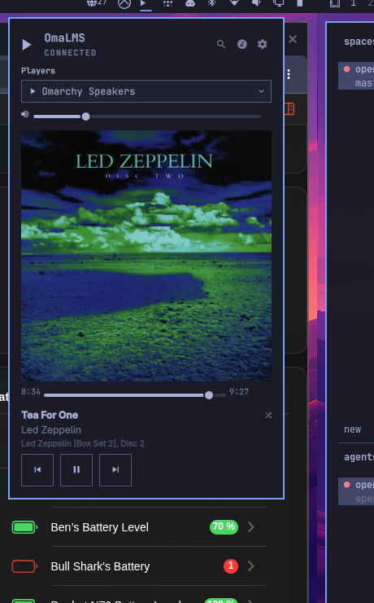

# OmaLMS

A first-party-quality Omarchy plugin for Lyrion Music Server (LMS /
Squeezebox): control any player connected to your LMS server from the
Omarchy bar — now playing, transport, volume, queue, shuffle, and search.



## Features

- **Bar widget** — now-playing marquee (title · artist) with a play/pause
  icon; click opens the panel. Collapses when nothing is playing.
- **Now playing** — cover art, progress bar with seek, title/artist/album,
  volume slider, transport (prev / play-pause / next).
- **Player selection** — dropdown of all players on the server, including
  sync groups; now-playing follows the selected player.
- **Queue mode** (☰ in the panel header) — browse the current playlist,
  jump to any track, delete single tracks, or clear the whole queue
  (with confirmation). Height-capped list with scrollbar.
- **Shuffle** — toggle between sequential and shuffle play in the queue
  header; reorders the current queue immediately and persists the mode.
  A passive shuffle indicator appears next to the song title when on.
- **Search** (🔍 in the panel header) — albums, artists, and playlists;
  play a result now or add it to the queue.
- **Keyboard navigation** — arrow keys cycle buttons and walk lists,
  Enter activates, Esc goes back, Tab switches between panels.

## Installation

```bash
omarchy plugin add https://github.com/powerk1977/omarchy-lms.git --enable
```

Then add the widget to the bar (it defaults to the right section):

```bash
omarchy bar move io.github.powerk1977.lms --section right
```

## Removal

```bash
omarchy plugin remove io.github.powerk1977.lms
```

## Requirements

- Omarchy (Quickshell-based shell) with plugin support
- A reachable [Lyrion Music Server](https://lyrion.org/) (LMS 9.x) on the
  network — discovered automatically, or configured manually in the
  plugin's settings (host/port)
- Password-protected servers are supported: credentials are stored only in
  the system keyring (`secret-tool`), never in config files or process
  arguments
- Python 3.11+ (stdlib only — the sidecar bridge in `bin/` has no pip
  dependencies)

## Updating

```bash
omarchy plugin update io.github.powerk1977.lms
```

## Development

See [DEVELOPING.md](DEVELOPING.md) for architecture and the verification
command suite.

## License

[MIT](LICENSE) — Lyrion Music Server / Squeezebox are products of the Lyrion
Community / Logitech. This is a third-party plugin, not affiliated.
